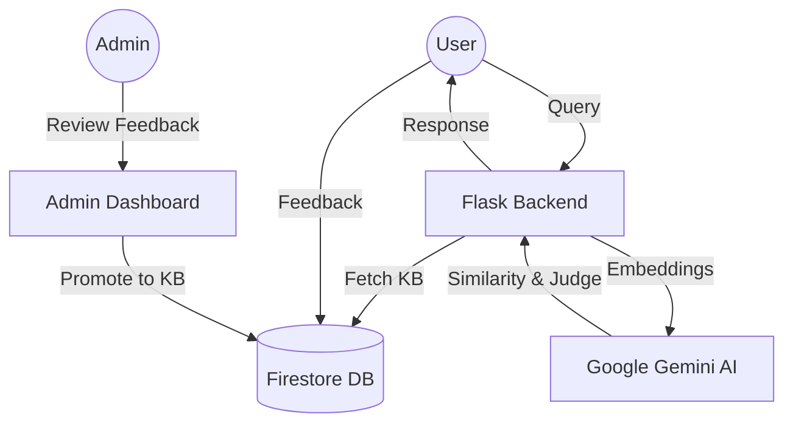

# System Architecture

ResolveX is designed as an intelligent, self-improving support automation system. It leverages large language models (LLMs), semantic search, and a "Human-in-the-Loop" feedback mechanism.

## High-Level Overview

---

## Key Components

### 1. The Learning Feedback Loop
The core innovation of ResolveX is its ability to learn from failures.
- **Capture**: When a user marks a response as "Not Helpful" and provides the correct answer, it is stored in Firestore.
- **Review**: Admins see these corrections in the dashboard.
- **Injection**: Admins can "Promote to KB" with one click, updating the AI's future knowledge base without any retraining or redeployment.

### 2. Semantic Similarity Logic
Instead of simple keyword matching, ResolveX uses `gemini-embedding-001` to understand the *meaning* of user queries.
- It calculates a semantic distance between the user's message and the existing Knowledge Base entries.
- If the similarity is low, the system automatically lowers the confidence score and marks the ticket for human escalation.

### 3. Cross-Verification (Judge AI Model)
To prevent LLM "hallucinations," ResolveX employs a secondary **Judge Prompt**.
- After a response is generated, a second call is made to a lighter, faster Gemini model (Flash Lite).
- This model acts as a fact-checker, comparing the generated response against the Knowledge Base entries.
- If the response contains information not found in the KB, the Judge flags it.

### 4. Conversational Memory
ResolveX maintains a short-term conversational context by storing the last few messages in the user's session. This allows for follow-up questions (e.g., "Tell me more about that") to be understood in context.

---

## Tech Stack
- **Web Framework**: Flask (Python)
- **Database**: Google Firestore (NoSQL)
- **Authentication**: Firebase Auth (Google & Email/Password)
- **AI Models**: 
  - `gemini-1.5-flash-latest`: Main reasoning and response generation.
  - `gemini-embedding-001`: Vector embeddings for semantic search.
  - `gemini-flash-lite-latest`: Fast verification (Judge model).
- **Frontend**: Vanilla HTML5, CSS3 (Glassmorphism), JavaScript (ES6+).
